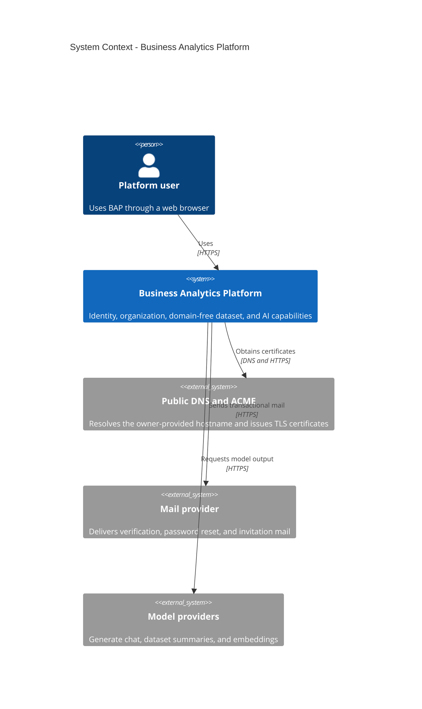
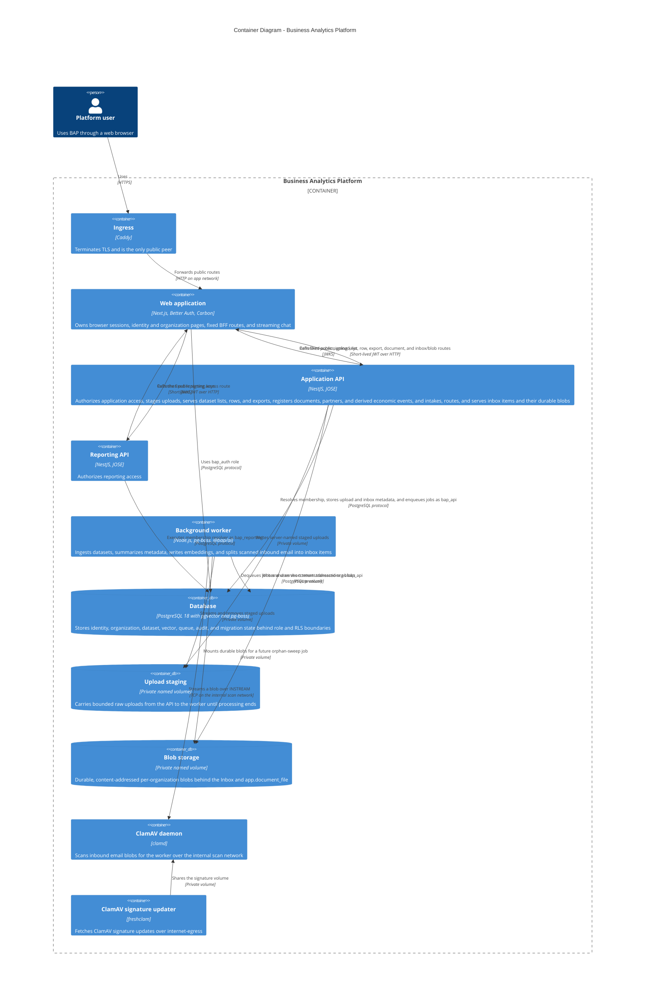
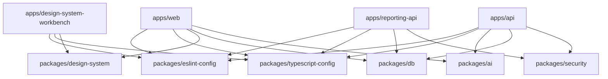
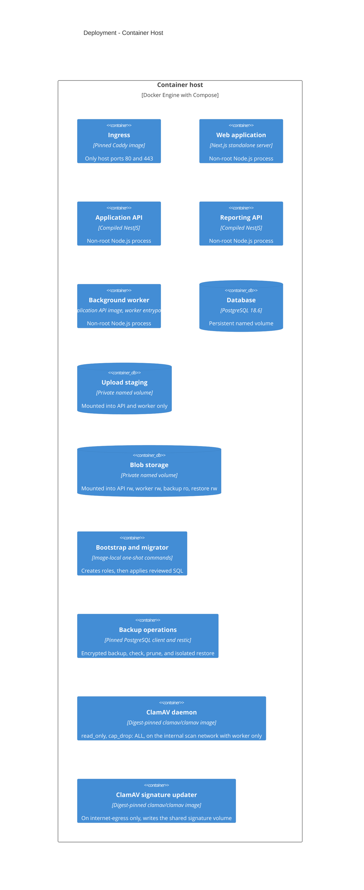

# BAP Architecture

## Scope

BAP is organized as 3 independently deployable TypeScript applications plus a
background-worker entrypoint behind Caddy with PostgreSQL 18 persistence. The
platform implements identity, organization access, database isolation,
observability, migration, backup, generic dataset ingestion and retrieval,
streaming export, bounded AI workflows, the Inbox intake boundary with durable
per-organization blob storage, and a first business-domain schema: the documents
register and its derived economic events. Broader analytics semantics remain out
of scope.

## System context

## Containers

The browser receives only opaque Better Auth cookies. Resource JWTs exist only
inside the 37 fixed BFF-to-service route shapes: application access, legal
entity list/create/update/delete, member entity-scope read/update, the bulk
entity-scope read, upload, dataset list, dataset rows, dataset export, document
list/create/read/update/delete, document link create/delete, partner
list/create/update, the shared directive-account chart, inbox upload, inbox item
list/read/hints/process/route-to-document/route-undo/discard/restore/assign/snooze,
blob download/inline, and reporting access. They contain `iss`, `aud`, `sub`,
`iat`, and `exp`. The web route validates and allow-lists each upstream response
or stream. No catch-all service proxy or browser Bearer-token flow exists.

One further resource JWT exists outside that browser-facing matrix: the web's
public `POST /api/intake/v1/items` route
([ADR 0016](docs/adr/0016-channel-principal.md)) resolves a hashed channel
credential and mints its JWT server-side, with no browser session, in front of
`InboxChannelController` in `apps/api`.

A second public, session-less route joins it: `POST /api/inbound/mailgun/mime`
in the web service receives inbound email, verifies the Mailgun signature,
resolves the recipient token to a channel, and forwards the raw MIME to
`POST /v1/organizations/:organizationId/inbox/channels/:channelId/email` in
front of the same controller, which stores the `.eml` and enqueues the
`split_email_item` pg-boss job with an ids-only payload
(`{ organizationId, channelId, itemId }`). The worker runs that job as the
channel principal, scans the blob through `clamd` using
`apps/api/src/scanning/clamd-client.ts`, and splits attachments into child inbox
items; see [ADR 0016](docs/adr/0016-channel-principal.md) (Webhook and Worker)
and [the inbox email channel spec](.ai/specs/2026-09-17-inbox-email-channel.md).

The web-local chat route requires a verified session, resolves application
access through the same fixed BFF boundary, and can optionally resolve one
visible dataset. Its provider prompt contains bounded dataset metadata and
column descriptions, never stored row values. Uploads stream through the BFF to
the application API, enter the private staging volume under a server-generated
identifier, and enqueue an identifier-only pg-boss job. The worker re-resolves
membership before each tenant operation, stream-parses CSV or XLSX, writes rows
in short RLS-scoped transactions, deletes the staged file, then chains summary
and embedding work for the ready dataset. Queue payloads and recorded job errors
carry no filename, cell, prompt, provider error, or secret.

Account deletion hard-deletes the Better Auth identity after a sole-owner guard
records its explicit id in an auth-schema pending request. The web role never
crosses into schema `app`. A one-shot operator command later assumes the NOLOGIN
`bap_eraser` role inside 1 transaction, anonymizes only the 5 approved subject
columns and deletes the subject's own entity scope rows behind forced RLS,
consumes the request, and retains no raw-id mapping. It refuses live and
unrequested identities.

Organization creation quota is durable auth-schema state separate from
membership. A database trigger serializes non-NULL creator-attributed inserts
with a transaction advisory lock and enforces count against quota atomically.
NULL identifies an unattributed legacy or system organization and consumes no
user quota. The web role can read quota but cannot grant it. Better Auth's
enabled creation path normalizes and validates the slug before framework side
effects, injects the authenticated creator through a non-input field, and makes
that creator an owner. Its fail-closed count is a usability precheck; the
trigger remains authoritative for races.

Ten installed organization endpoints that could otherwise fall back to session
active-organization state require a bindable explicit organization id. The
eleventh, `get-active-member`, cannot bind an id and is always rejected by the
auth hook and public router. Better Auth creation and invitation acceptance may
update stored active-organization state, but no supported BAP operation uses it
as an implicit selector. Public active-organization mutation and organization
deletion are disabled. A host operator can change quota only through the
one-shot migrator CLI, which sets the owner role locally inside 1 transaction
and records a required note.

## Tenancy model

An organization is a workspace, not a legal entity. ADR 0011 gives it many inner
legal entities, companies or sole traders, held in `app.legal_entity`, and every
dataset and upload belongs to exactly one. The organization stays the only row
level security boundary: reads stay organization-wide, and `owner`/`admin` write
gating and entity deletion are enforced in PostgreSQL through the `bap.role`
tenant-transaction setting and its `app.role_can_write()`/`app.role_is_owner()`
helpers. Entity selection and the restricted scope for an admin or member are
application-level filters, applied by one shared resolver in the application API
from `app.member_entity_scope` and `app.legal_entity_access`, never a database
policy. `owner` manages organization settings, members, invitations, entity
access, and entity deletion; `admin` creates and updates entities and uploads
data; `member` is read-only aside from the assistant. Per-dataset grants are
removed.

`apps/api` adds `GET`/`POST /v1/organizations/:organizationId/legal-entities`,
`PATCH`/`DELETE .../legal-entities/:legalEntityId`, and
`GET`/`PUT .../members/:userId/entity-scope`, `GET .../entity-scopes` for every
stored scope at once, and extends `GET .../datasets` with an optional
`legalEntityId` filter and `POST .../uploads` with a required `legalEntityId`
field. `apps/web` mirrors every route through the BFF and adds
`/[orgSlug]/entities` to list, create, edit, and delete legal entities by
capability, an owner-only entity scope editor on `/[orgSlug]/members`, and an
entity scope switch plus upload entity selector on `/datasets`.

Migration `20260914.0002` adds the documents register on the same tenancy shape:
`app.document`, `app.invoice`, `app.invoice_line`, `app.economic_event`, and
`app.economic_event_line` each carry `organization_id` for row level security
and `legal_entity_id` pinned by a composite foreign key to
`app.legal_entity(id, organization_id)`, exactly like `app.dataset` and
`app.upload`. `app.partner` is organization-wide rather than entity-scoped,
because the same counterparty can transact with several of an organization's
legal entities, and `app.directive_account` carries no tenant column at all,
because the shared chart of accounts is identical for every organization. See
[documents](docs/documents.md) for the full model.

Migration `20260916.0002` adds the Inbox and the durable blob register on the
same tenancy shape: `app.blob`, `app.inbox_item`, `app.inbox_item_file`,
`app.inbox_item_extraction`, `app.inbox_event`, and `app.document_file` each
carry `organization_id` for row level security, and `app.inbox_item` carries a
nullable `legal_entity_id` until the item is routed or pre-bound by its channel.
`app.document` gains `inbox_item_id`. See
[ADR 0015](docs/adr/0015-inbox-intake-model.md) and
[the inbox plan](docs/planning/inbox.md) for the full model.

Migrations `20260917.0001` and `20260917.0002` add the channel principal of
[ADR 0016](docs/adr/0016-channel-principal.md): `app.inbox_channel` and the
`auth`-schema credential table `auth.inbox_channel_credential`, resolved by
`resolveChannelAccess` in `apps/api/src/channel-access.ts` and served by
`InboxChannelController`, give a non-human caller a role,
`bap.role = 'channel'`, that is denied by construction everywhere except the
inbox tables. Migration `20260917.0003` adds the email channel of ADR 0016's
Webhook and Worker sections: `app.record_blob_scan`, the platform-unique
`inbox_channel.email_address`, the recreated `auth.issue_channel_credential`
with its `email_address` kind, and `app.inbox_item.sender`.

## Workspace dependency rules

Applications do not import one another. Packages cannot import applications.
`@bap/db` is the only database boundary, `@bap/security` owns service-neutral
JWT/access contracts, and `@bap/design-system` is the only UI library. `@bap/ai`
owns the model-provider boundary. The web streaming chat route consumes it
directly, and the worker entrypoint built from `apps/api` consumes it for
dataset summarization and embedding.

The client-only `@bap/design-system/icons` entrypoint is an exact 27-export
curated named facade, not a mirror of the full upstream icon module. Application
code imports no `@carbon/icons-react` symbol directly. The generated catalog
retains the complete installed upstream inventory for upgrade inspection, while
the workbench renders those 27 application glyphs and the complete 1,575-export
pictogram inventory.

The design-system workbench is a development and static-reference application,
not a production container. It consumes only public `@bap/design-system`
entrypoints and verifies the generated Carbon catalog, executable stories, and
offline handbook against the pinned upstream release.

## Deployment

The production model has non-internal `edge`, internal `app`, internal `data`,
internal `scan`, and non-internal `internet-egress` and `operations-egress`
networks. Caddy is the only published service. Only the web application and the
background worker join `internet-egress`, where they reach mail and AI
providers, and, for `freshclam` only, the ClamAV signature mirror; the
application API and the reporting API deliberately keep no outbound path. The
`scan` network carries only `clamd` and `worker`, so the ClamAV daemon that
parses hostile email attachments has no route to the internet or to the
database. Only one-shot restic clients join `operations-egress`; backup and
restore also join `data`. Each runtime mounts only its own credential files.
Caddy certificate state and PostgreSQL data use named volumes. A third named
volume stages uploaded files between the application API and the worker; it is
mounted into that pair and into no other service, which
`scripts/verify-compose.mjs` asserts. Backup scheduling, backend-specific
credentials, and off-host durability require owner configuration.

A fourth named volume, `blob_storage`, holds durable, content-addressed
per-organization blobs behind the Inbox (`apps/api/src/inbox`) and the
`BlobStore` interface (`apps/api/src/blobs`). Uploaded bytes are no longer
transient: unlike the staging volume, they are never deleted after intake. Its
member set is the application API (rw), the worker (rw), the `backup` service
(ro), and `restore` (rw), which `scripts/verify-compose.mjs` also asserts.
`BAP_BLOB_STORAGE_DIR` sets its mount path and
`BAP_BLOB_QUOTA_BYTES_PER_ORGANIZATION` bounds it per organization; see
[ADR 0014](docs/adr/0014-durable-blob-storage.md) and
[ADR 0015](docs/adr/0015-inbox-intake-model.md).

The profiled owner-bootstrap service is the only dual-tier exception: it mounts
the auth credential used by Better Auth and a separate migrator credential used
only to establish the minimum initial organization quota. The migrator pool is
closed before the organization API call. The gated operational synthetic setup
runs as a command override of this one-shot service. Its second input shape adds
a verified user to an organization already resolved by slug through a narrow
`@bap/db` accessor, creating no organization and consuming no quota. Long-lived
web has neither the migrator environment path nor its secret mount.

The general organization-quota command runs in the existing one-shot migrator
service. It has no auth credential, web route, or long-lived process and returns
only the resulting quota row as JSON.

Organization slugs are resolved only in the Next.js web tier. The dynamic layout
validates the slug, requires a verified browser session, and calls a narrow
`@bap/db` accessor which joins `auth.organization` to `auth.member` by slug and
session user id through `bap_auth`. React `cache` deduplicates that whole
resolution within 1 request only. Every negative or failed lookup becomes the
same 404, and no slug-to-id mapping is cached across requests. The BFF,
application API, reporting API, RLS context, and service membership resolver
remain id-only. The root route redirects to `/workspaces`. The `/workspaces`
index and `/workspaces/new` are Carbon pages inside `PageContainer`: the index
lists the caller's workspaces with their role through a narrow `@bap/db`
membership accessor, shows a get-started checklist when empty, and lists pending
invitations with accept and decline server actions; the create page renders a
Carbon form with live slug validation and quota-gated creation. Since ADR 0011
the landing page at `/[orgSlug]`, the legal entities page at
`/[orgSlug]/entities`, the members page at `/[orgSlug]/members`, and the
settings page at `/[orgSlug]/settings` are Carbon pages that read from the BFF
and Better Auth, so the temporary `[orgSlug]` loop is gone. The landing page
reads members, invitations, entities, and datasets counts server-side and
exposes navigation only; the others mutate by client call. The shared slug
resolver maps the route server-side and each read and client mutation carries
the resolved organization id; no browser-supplied id or ambient active
organization selects a tenant.

The landing page renders inside the shared Carbon product shell like the other
organization pages. The layout and shared slug resolver remain durable.
Publishing the literal `/organizations` route advanced the reserved database and
TypeScript slug contract through migration `20260831.0004`, and migration
`20260916.0001` reserves the flat workspace routes.

Authenticated `app/(product)` routes share a server layout that renders the
client `ProductShell`, a Carbon UI Shell header branded "Afframe Analytics" over
a pinned-persistable left icon rail for Workspaces, Datasets, Inbox, Documents,
and Account, and a workspace section shown when an organization is active. The
`/inbox` page drops multi-file uploads, reviews their detected type, hints, and
routing draft, and routes them into Documents. The account area holds Carbon
profile, security, and preferences pages plus the access diagnostic at
`/account/access`; `/access` redirects there. Header actions open single-purpose
panels for search, help, account, and workspace switching. The search panel
builds a client index from the rail destinations, the signed-in account's
workspaces, and the active workspace's legal entities. The help panel links the
public docs, the running version, and an optional feedback address. The account
panel holds identity, the account links, the light/dark/system theme control,
and sign out. The shell is not rendered around identity, invitation, or
design-system reference routes. The layout owns the single `main-content`
landmark and renders small Carbon breadcrumbs from the route segments, including
subordinate organization pages and the inline dataset detail. The complete
discoverability and state contract is recorded in
[the application route map](docs/application-routes.md).

The separately selected development and operational-proof Mailpit overlay adds 1
ephemeral sink on the `app` network. Web sends to its internal cleartext SMTP
port and awaits verification-message acceptance before returning the development
auth response; production Resend remains non-blocking. A non-root, read-only
companion exposes only GET `/readyz` and GET `/api/v1/search` on host loopback;
every other path and method returns 404. It runs with every capability dropped
and no additions. The public Caddy configuration has no Mailpit route. Mailpit
has no provider credential, persistent volume, or production service. Bootstrap
omits the overlay, and production mail continues through Resend on
`internet-egress`.

## Operational map

| Process           | Internal port | Public surface            | Private readiness |
| ----------------- | ------------: | ------------------------- | ----------------- |
| Caddy             |       80, 443 | All browser traffic       | Config validation |
| Web               |          3000 | `GET /health`             | `GET /ready`      |
| Application API   |          3001 | None                      | `GET /ready`      |
| Reporting API     |          3002 | None                      | `GET /ready`      |
| Background worker |          3003 | None                      | `GET /ready`      |
| PostgreSQL        |          5432 | Development loopback      | `pg_isready`      |
| Mailpit           |    1025, 8025 | None                      | `GET /readyz`     |
| Mailpit API proxy |          8025 | Development loopback only | `GET /readyz`     |

## Deliberately deferred

The documents register, described in [documents](docs/documents.md), is the
first business-domain schema and is no longer deferred. Source adapters that
import documents from Money S3, Pohoda, ISDOC, or a bank feed, table-driven rule
overrides in place of the code-and-version-string rule set, a re-versioning
endpoint for the document version chain, bank matching and settlement beyond the
generic document link, and reporting-API reads of documents or economic events
remain deferred; see [documents](docs/documents.md) for the full out-of-scope
list.

The Inbox intake boundary and its durable per-organization blob storage,
described in [ADR 0014](docs/adr/0014-durable-blob-storage.md) and
[ADR 0015](docs/adr/0015-inbox-intake-model.md), are also no longer deferred.
Uploaded bytes behind an inbox item or a document are durable, never deleted
after intake. Inbox channels beyond manual upload, the `inbox_channel` and
`inbox_rule` tables, a non-human channel principal, a per-organization quota
setting, routing target settings, the orphan blob sweep, and any AI or parser
provider remain deferred; see [the inbox plan](docs/planning/inbox.md) for the
full list.

Metric definitions, aggregation and transformation semantics beyond derivation,
derived datasets, cross-dataset joins, dataset editing and versioning, custom
roles, workspace deletion, cross-workspace queries, SSO, distributed caches or
limits, OpenTelemetry, PDF export, billing, HA, registry publishing, and
deployment automation require real owner or product requirements. A multi-host
object store such as S3 or MinIO remains deferred behind the same `BlobStore`
interface until a second host exists (ADR 0014). Per-dataset sharing is
superseded by legal-entity scope rather than deferred. See
[the approved SaaS foundation plan](docs/planning/saas-foundation.md) and
[the platform batteries plan](docs/planning/platform-batteries.md).
