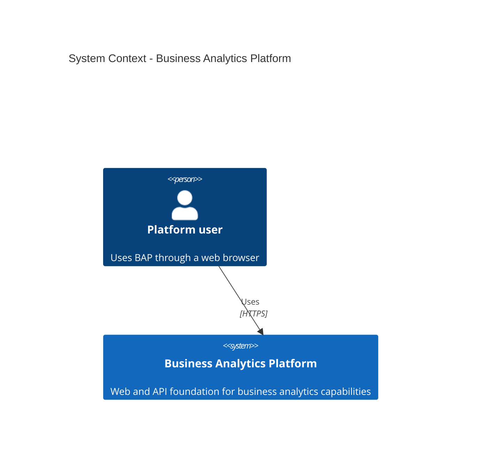
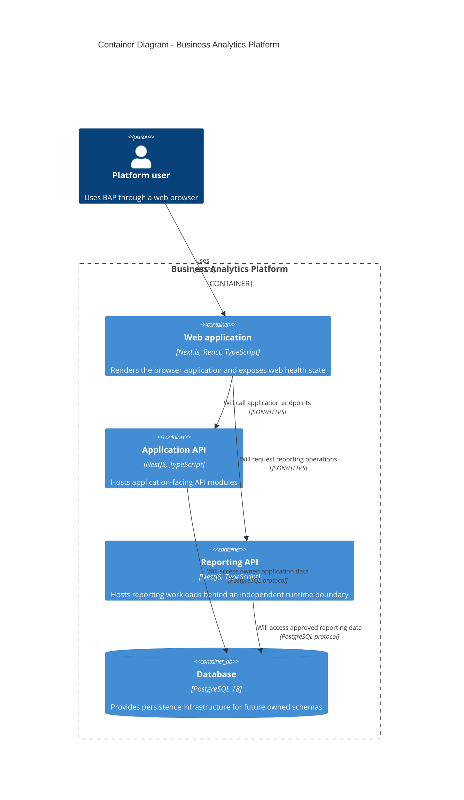
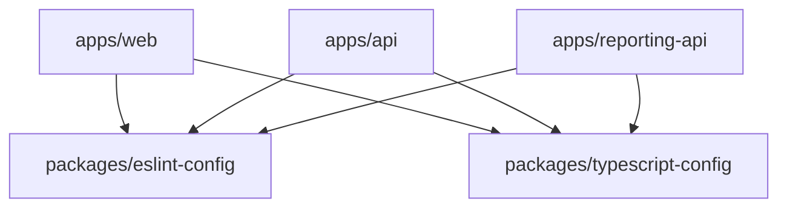
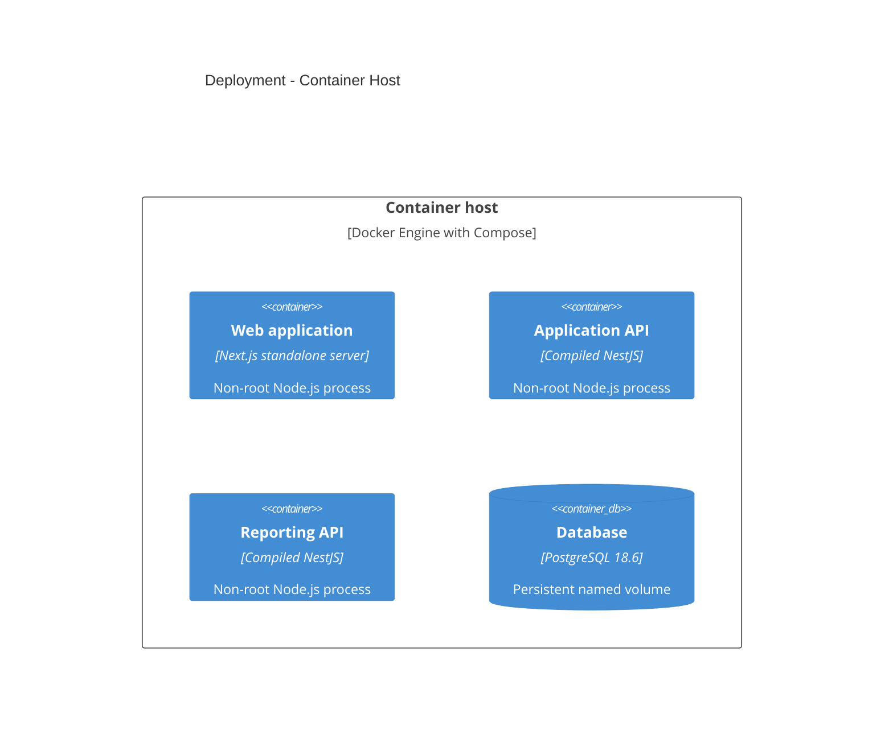

# BAP Architecture

## Scope

BAP is organized as 3 independently deployable TypeScript applications with a
PostgreSQL 18 service. This foundation supplies build, test, runtime, and
container boundaries. Domain modules, persistence ownership, authentication,
authorization, tenancy, and external integrations are intentionally deferred.

## System context

## Containers

The API-to-database relations describe the intended container boundary. No
database client, schema, or query exists yet because persistence requirements
have not been selected.

## Workspace dependency rules

Applications do not import one another. Packages cannot import applications. The
repository intentionally has no generic `shared`, `common`, `contracts`, or
domain package.

## Deployment

The canonical Compose model is `compose.yaml`. Development and production files
add explicit host bindings and runtime policies. PostgreSQL is never published
by the production model.

## Operational map

| Process         |  Default port | Health endpoint | Build artifact                                         |
| --------------- | ------------: | --------------- | ------------------------------------------------------ |
| Web             |          3000 | `GET /health`   | Next.js standalone output                              |
| Application API |          3001 | `GET /health`   | `apps/api/dist` plus production dependencies           |
| Reporting API   |          3002 | `GET /health`   | `apps/reporting-api/dist` plus production dependencies |
| PostgreSQL      | 5432 internal | `pg_isready`    | `postgres:18.6-bookworm` with named volume             |

## Deferred decisions

Phase 4 owns decisions for authentication, authorization, tenancy, database
access, migrations, observability, queues, caching, ingress, deployment
automation, secrets management, backups, and SaaS operations.
