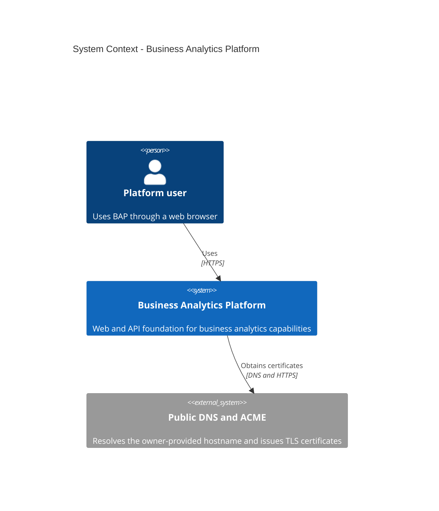
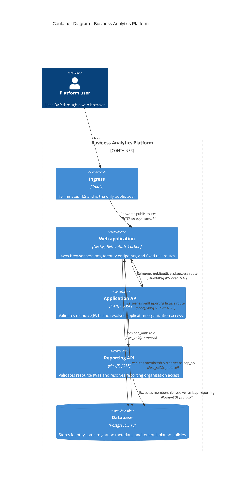
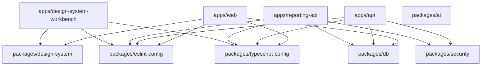
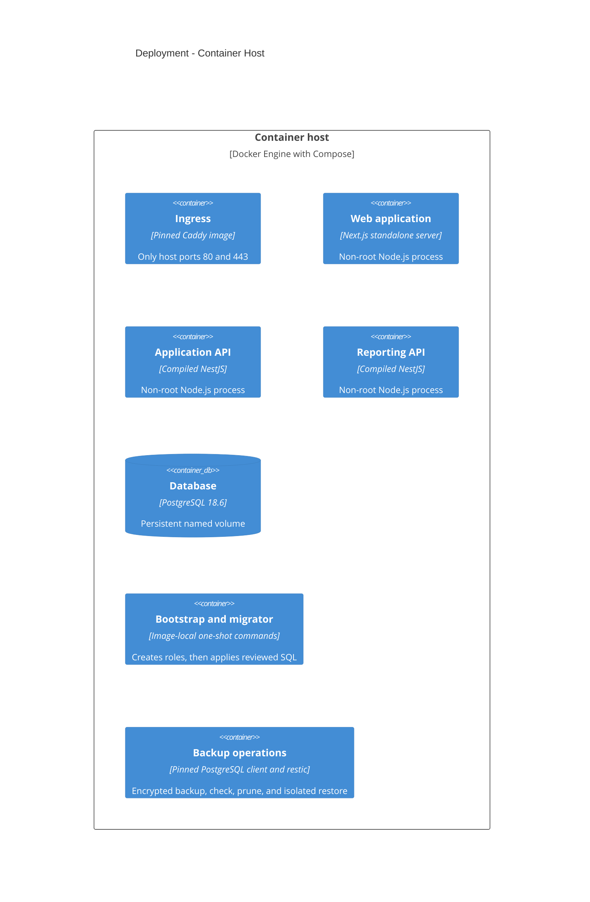

# BAP Architecture

## Scope

BAP is organized as 3 independently deployable TypeScript applications behind
Caddy with PostgreSQL 18 persistence. The foundation implements identity,
organization access, database isolation, observability, migration, backup, and
container boundaries. Analytics and other product modules remain out of scope.

## System context

## Containers

The browser receives only opaque Better Auth cookies. Resource JWTs exist only
inside a fixed BFF-to-service request and contain `iss`, `aud`, `sub`, `iat`,
and `exp`. No catch-all proxy or browser Bearer-token flow exists.

## Workspace dependency rules

Applications do not import one another. Packages cannot import applications.
`@bap/db` is the only database boundary, `@bap/security` owns service-neutral
JWT/access contracts, and `@bap/design-system` is the only UI library. `@bap/ai`
owns the model-provider boundary and has no application consumer yet, so no
application edge points at it.

The design-system workbench is a development and static-reference application,
not a production container. It consumes only public `@bap/design-system`
entrypoints and verifies the generated Carbon catalog, executable stories, and
offline handbook against the pinned upstream release.

## Deployment

The production model has non-internal `edge`, internal `app`, internal `data`,
and non-internal `internet-egress` and `operations-egress` networks. Caddy is
the only published service. Only the web application and the background worker
join `internet-egress`, where they reach mail and AI providers; the application
API and the reporting API deliberately keep no outbound path. Only one-shot
restic clients join `operations-egress`; backup and restore also join `data`.
Each runtime mounts only its own credential files. Caddy certificate state and
PostgreSQL data use named volumes. A third named volume stages uploaded files
between the application API and the worker; it is mounted into that pair and
into no other service, which `scripts/verify-compose.mjs` asserts. Backup
scheduling, backend-specific credentials, and off-host durability require owner
configuration.

## Operational map

| Process         | Internal port | Public surface       | Private readiness |
| --------------- | ------------: | -------------------- | ----------------- |
| Caddy           |       80, 443 | All browser traffic  | Config validation |
| Web             |          3000 | `GET /health`        | `GET /ready`      |
| Application API |          3001 | None                 | `GET /ready`      |
| Reporting API   |          3002 | None                 | `GET /ready`      |
| PostgreSQL      |          5432 | Development loopback | `pg_isready`      |

## Deliberately deferred

SSO, distributed caches or limits, OpenTelemetry, PDF export, billing, uploads
to object storage, HA, registry publishing, deployment automation, and product
schemas require real owner or product requirements. See
[the approved SaaS foundation plan](docs/planning/saas-foundation.md) and
[the platform batteries plan](docs/planning/platform-batteries.md).
