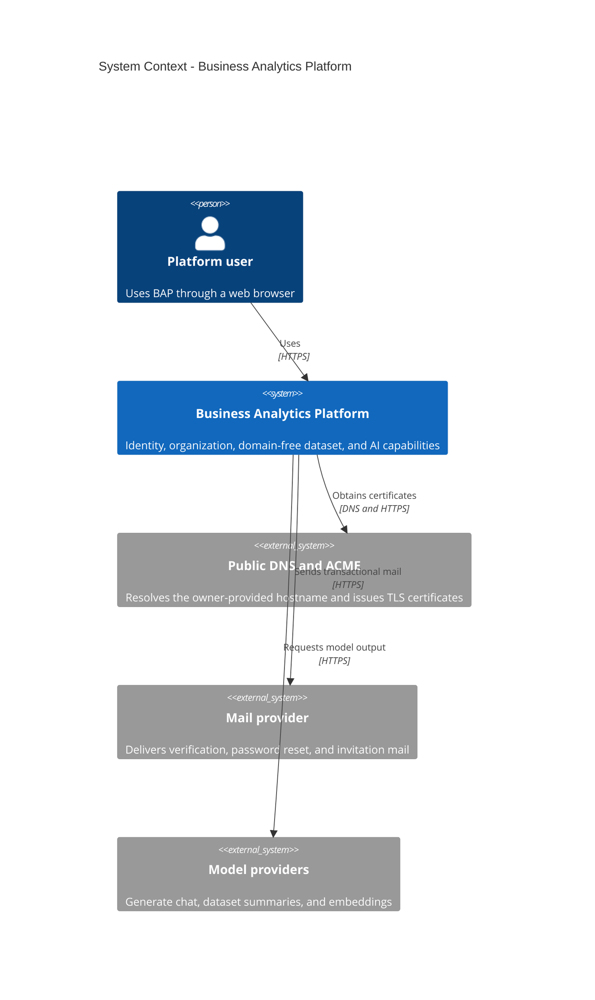
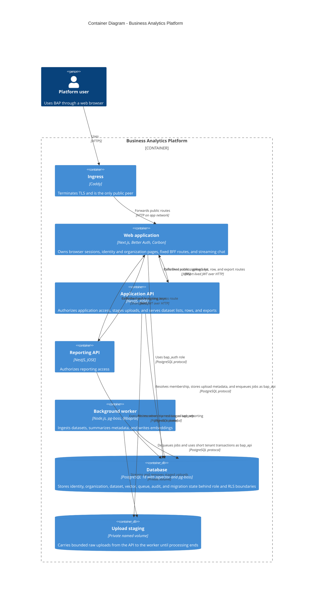
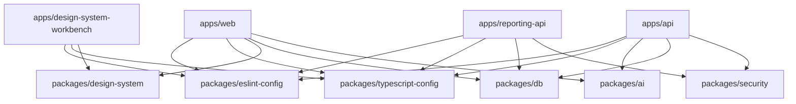
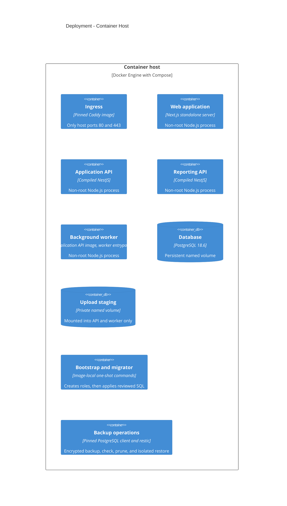

# BAP Architecture

## Scope

BAP is organized as 3 independently deployable TypeScript applications plus a
background-worker entrypoint behind Caddy with PostgreSQL 18 persistence. The
platform implements identity, organization access, database isolation,
observability, migration, backup, generic dataset ingestion and retrieval,
streaming export, and bounded AI workflows. Business-domain schemas and
analytics semantics remain out of scope.

## System context

## Containers

The browser receives only opaque Better Auth cookies. Resource JWTs exist only
inside the 13 fixed BFF-to-service route shapes: application access, legal
entity list/create/update/delete, member entity-scope read/update, the bulk
entity-scope read, upload, dataset list, dataset rows, dataset export, and
reporting access. They contain `iss`, `aud`, `sub`, `iat`, and `exp`. The web
route validates and allow-lists each upstream response or stream. No catch-all
service proxy or browser Bearer-token flow exists.

The web-local chat route requires a verified session, resolves application
access through the same fixed BFF boundary, and can optionally resolve one
visible dataset. Its provider prompt contains bounded dataset metadata and
column descriptions, never stored row values. Uploads stream through the BFF to
the application API, enter the private staging volume under a server-generated
identifier, and enqueue an identifier-only pg-boss job. The worker re-resolves
membership before each tenant operation, stream-parses CSV or XLSX, writes rows
in short RLS-scoped transactions, deletes the staged file, then chains summary
and embedding work for the ready dataset. Queue payloads and recorded job errors
carry no filename, cell, prompt, provider error, or secret.

Account deletion hard-deletes the Better Auth identity after a sole-owner guard
records its explicit id in an auth-schema pending request. The web role never
crosses into schema `app`. A one-shot operator command later assumes the NOLOGIN
`bap_eraser` role inside 1 transaction, anonymizes only the 5 approved subject
columns and deletes the subject's own entity scope rows behind forced RLS,
consumes the request, and retains no raw-id mapping. It refuses live and
unrequested identities.

Organization creation quota is durable auth-schema state separate from
membership. A database trigger serializes non-NULL creator-attributed inserts
with a transaction advisory lock and enforces count against quota atomically.
NULL identifies an unattributed legacy or system organization and consumes no
user quota. The web role can read quota but cannot grant it. Better Auth's
enabled creation path normalizes and validates the slug before framework side
effects, injects the authenticated creator through a non-input field, and makes
that creator an owner. Its fail-closed count is a usability precheck; the
trigger remains authoritative for races.

Ten installed organization endpoints that could otherwise fall back to session
active-organization state require a bindable explicit organization id. The
eleventh, `get-active-member`, cannot bind an id and is always rejected by the
auth hook and public router. Better Auth creation and invitation acceptance may
update stored active-organization state, but no supported BAP operation uses it
as an implicit selector. Public active-organization mutation and organization
deletion are disabled. A host operator can change quota only through the
one-shot migrator CLI, which sets the owner role locally inside 1 transaction
and records a required note.

## Tenancy model

An organization is a workspace, not a legal entity. ADR 0011 gives it many inner
legal entities, companies or sole traders, held in `app.legal_entity`, and every
dataset and upload belongs to exactly one. The organization stays the only row
level security boundary: reads stay organization-wide, and `owner`/`admin` write
gating and entity deletion are enforced in PostgreSQL through the `bap.role`
tenant-transaction setting and its `app.role_can_write()`/`app.role_is_owner()`
helpers. Entity selection and the restricted scope for an admin or member are
application-level filters, applied by one shared resolver in the application API
from `app.member_entity_scope` and `app.legal_entity_access`, never a database
policy. `owner` manages organization settings, members, invitations, entity
access, and entity deletion; `admin` creates and updates entities and uploads
data; `member` is read-only aside from the assistant. Per-dataset grants are
removed.

`apps/api` adds `GET`/`POST /v1/organizations/:organizationId/legal-entities`,
`PATCH`/`DELETE .../legal-entities/:legalEntityId`, and
`GET`/`PUT .../members/:userId/entity-scope`, `GET .../entity-scopes` for every
stored scope at once, and extends `GET .../datasets` with an optional
`legalEntityId` filter and `POST .../uploads` with a required `legalEntityId`
field. `apps/web` mirrors every route through the BFF and adds
`/[orgSlug]/entities` to list, create, edit, and delete legal entities by
capability, an owner-only entity scope editor on `/[orgSlug]/members`, and an
entity scope switch plus upload entity selector on `/datasets`.

## Workspace dependency rules

Applications do not import one another. Packages cannot import applications.
`@bap/db` is the only database boundary, `@bap/security` owns service-neutral
JWT/access contracts, and `@bap/design-system` is the only UI library. `@bap/ai`
owns the model-provider boundary. The web streaming chat route consumes it
directly, and the worker entrypoint built from `apps/api` consumes it for
dataset summarization and embedding.

The client-only `@bap/design-system/icons` entrypoint is an exact 18-export
curated named facade, not a mirror of the full upstream icon module. Application
code imports no `@carbon/icons-react` symbol directly. The generated catalog
retains the complete installed upstream inventory for upgrade inspection, while
the workbench renders those 18 application glyphs and the complete 1,575-export
pictogram inventory.

The design-system workbench is a development and static-reference application,
not a production container. It consumes only public `@bap/design-system`
entrypoints and verifies the generated Carbon catalog, executable stories, and
offline handbook against the pinned upstream release.

## Deployment

The production model has non-internal `edge`, internal `app`, internal `data`,
and non-internal `internet-egress` and `operations-egress` networks. Caddy is
the only published service. Only the web application and the background worker
join `internet-egress`, where they reach mail and AI providers; the application
API and the reporting API deliberately keep no outbound path. Only one-shot
restic clients join `operations-egress`; backup and restore also join `data`.
Each runtime mounts only its own credential files. Caddy certificate state and
PostgreSQL data use named volumes. A third named volume stages uploaded files
between the application API and the worker; it is mounted into that pair and
into no other service, which `scripts/verify-compose.mjs` asserts. Backup
scheduling, backend-specific credentials, and off-host durability require owner
configuration.

The profiled owner-bootstrap service is the only dual-tier exception: it mounts
the auth credential used by Better Auth and a separate migrator credential used
only to establish the minimum initial organization quota. The migrator pool is
closed before the organization API call. The gated operational synthetic setup
runs as a command override of this one-shot service. Its second input shape adds
a verified user to an organization already resolved by slug through a narrow
`@bap/db` accessor, creating no organization and consuming no quota. Long-lived
web has neither the migrator environment path nor its secret mount.

The general organization-quota command runs in the existing one-shot migrator
service. It has no auth credential, web route, or long-lived process and returns
only the resulting quota row as JSON.

Organization slugs are resolved only in the Next.js web tier. The dynamic layout
validates the slug, requires a verified browser session, and calls a narrow
`@bap/db` accessor which joins `auth.organization` to `auth.member` by slug and
session user id through `bap_auth`. React `cache` deduplicates that whole
resolution within 1 request only. Every negative or failed lookup becomes the
same 404, and no slug-to-id mapping is cached across requests. The BFF,
application API, reporting API, RLS context, and service membership resolver
remain id-only. The root route redirects to `/organizations`; that index and the
first descendant `[orgSlug]` page are now the deliberately plain Phase 10
organization loop. The index lists current memberships and links quota-gated
creation. Descendant pages expose navigation, members, pending invitations,
name/slug settings, and, since ADR 0011, legal entities at
`/[orgSlug]/entities`. Every mutation is a server action which resolves the slug
through the same member gate and supplies the resulting organization id to
Better Auth; no browser-supplied id or ambient active organization selects a
tenant.

These six pages are explicitly throwaway milestone UI. They use semantic HTML,
native forms, no page CSS, and no design-system import. The layout and shared
slug resolver remain durable. Publishing the literal `/organizations` route also
advances the reserved database and TypeScript slug contract through migration
`20260831.0004`.

Authenticated application pages share a minimal Carbon shell with a skip link
and primary links to Access, Organizations, Datasets, and Account. The shell is
not rendered around identity, invitation, or design-system reference routes.
Subordinate organization pages use plain native breadcrumbs while their page
content remains temporary; the inline dataset detail uses a Carbon breadcrumb.
The complete discoverability and state contract is recorded in
[the application route map](docs/application-routes.md).

The separately selected development and operational-proof Mailpit overlay adds 1
ephemeral sink on the `app` network. Web sends to its internal cleartext SMTP
port and awaits verification-message acceptance before returning the development
auth response; production Resend remains non-blocking. A non-root, read-only
companion exposes only GET `/readyz` and GET `/api/v1/search` on host loopback;
every other path and method returns 404. It runs with every capability dropped
and no additions. The public Caddy configuration has no Mailpit route. Mailpit
has no provider credential, persistent volume, or production service. Bootstrap
omits the overlay, and production mail continues through Resend on
`internet-egress`.

## Operational map

| Process           | Internal port | Public surface            | Private readiness |
| ----------------- | ------------: | ------------------------- | ----------------- |
| Caddy             |       80, 443 | All browser traffic       | Config validation |
| Web               |          3000 | `GET /health`             | `GET /ready`      |
| Application API   |          3001 | None                      | `GET /ready`      |
| Reporting API     |          3002 | None                      | `GET /ready`      |
| Background worker |          3003 | None                      | `GET /ready`      |
| PostgreSQL        |          5432 | Development loopback      | `pg_isready`      |
| Mailpit           |    1025, 8025 | None                      | `GET /readyz`     |
| Mailpit API proxy |          8025 | Development loopback only | `GET /readyz`     |

## Deliberately deferred

Business-domain tables, metric definitions, aggregation and transformation
semantics, derived datasets, cross-dataset joins, dataset editing and
versioning, custom roles, workspace deletion, cross-workspace queries, SSO,
distributed caches or limits, OpenTelemetry, PDF export, billing, object
storage, HA, registry publishing, and deployment automation require real owner
or product requirements. Per-dataset sharing is superseded by legal-entity scope
rather than deferred. See
[the approved SaaS foundation plan](docs/planning/saas-foundation.md) and
[the platform batteries plan](docs/planning/platform-batteries.md).
