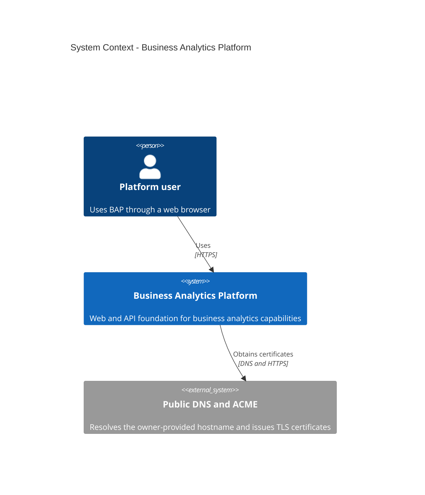
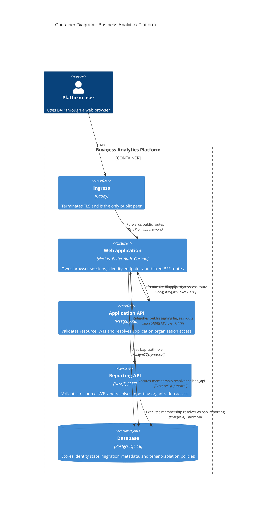
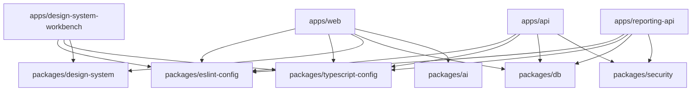
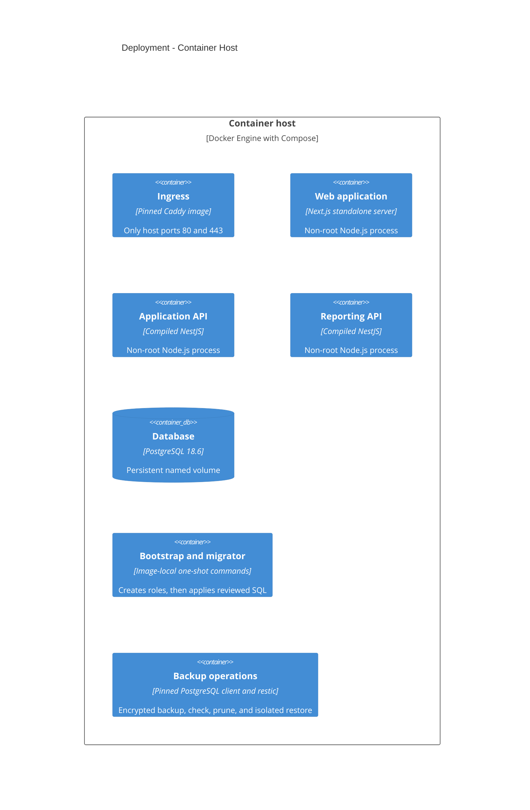

# BAP Architecture

## Scope

BAP is organized as 3 independently deployable TypeScript applications behind
Caddy with PostgreSQL 18 persistence. The foundation implements identity,
organization access, database isolation, observability, migration, backup, and
container boundaries. Analytics and other product modules remain out of scope.

## System context

## Containers

The browser receives only opaque Better Auth cookies. Resource JWTs exist only
inside a fixed BFF-to-service request and contain `iss`, `aud`, `sub`, `iat`,
and `exp`. No catch-all proxy or browser Bearer-token flow exists.

Account deletion hard-deletes the Better Auth identity after a sole-owner guard
records its explicit id in an auth-schema pending request. The web role never
crosses into schema `app`. A one-shot operator command later assumes the NOLOGIN
`bap_eraser` role inside 1 transaction, anonymizes only the 3 approved subject
columns behind forced RLS, consumes the request, and retains no raw-id mapping.
It refuses live and unrequested identities.

Organization creation quota is durable auth-schema state separate from
membership. A database trigger serializes non-NULL creator-attributed inserts
with a transaction advisory lock and enforces count against quota atomically.
NULL identifies an unattributed legacy or system organization and consumes no
user quota. The web role can read quota but cannot grant it. Better Auth's
enabled creation path normalizes and validates the slug before framework side
effects, injects the authenticated creator through a non-input field, and makes
that creator an owner. Its fail-closed count is a usability precheck; the
trigger remains authoritative for races.

Ten installed organization endpoints that could otherwise fall back to session
active-organization state require a bindable explicit organization id. The
eleventh, `get-active-member`, cannot bind an id and is always rejected by the
auth hook and public router. Better Auth creation and invitation acceptance may
update stored active-organization state, but no supported BAP operation uses it
as an implicit selector. Public active-organization mutation and organization
deletion are disabled. A host operator can change quota only through the
one-shot migrator CLI, which sets the owner role locally inside 1 transaction
and records a required note.

## Workspace dependency rules

Applications do not import one another. Packages cannot import applications.
`@bap/db` is the only database boundary, `@bap/security` owns service-neutral
JWT/access contracts, and `@bap/design-system` is the only UI library. `@bap/ai`
owns the model-provider boundary, and the web streaming chat route is its only
application consumer.

The design-system workbench is a development and static-reference application,
not a production container. It consumes only public `@bap/design-system`
entrypoints and verifies the generated Carbon catalog, executable stories, and
offline handbook against the pinned upstream release.

## Deployment

The production model has non-internal `edge`, internal `app`, internal `data`,
and non-internal `internet-egress` and `operations-egress` networks. Caddy is
the only published service. Only the web application and the background worker
join `internet-egress`, where they reach mail and AI providers; the application
API and the reporting API deliberately keep no outbound path. Only one-shot
restic clients join `operations-egress`; backup and restore also join `data`.
Each runtime mounts only its own credential files. Caddy certificate state and
PostgreSQL data use named volumes. A third named volume stages uploaded files
between the application API and the worker; it is mounted into that pair and
into no other service, which `scripts/verify-compose.mjs` asserts. Backup
scheduling, backend-specific credentials, and off-host durability require owner
configuration.

The profiled owner-bootstrap service is the only dual-tier exception: it mounts
the auth credential used by Better Auth and a separate migrator credential used
only to establish the minimum initial organization quota. The migrator pool is
closed before the organization API call. The gated operational synthetic setup
runs as a command override of this one-shot service. Long-lived web has neither
the migrator environment path nor its secret mount.

The general organization-quota command runs in the existing one-shot migrator
service. It has no auth credential, web route, or long-lived process and returns
only the resulting quota row as JSON.

Organization slugs are resolved only in the Next.js web tier. The dynamic layout
validates the slug, requires a verified browser session, and calls a narrow
`@bap/db` accessor which joins `auth.organization` to `auth.member` by slug and
session user id through `bap_auth`. React `cache` deduplicates that whole
resolution within 1 request only. Every negative or failed lookup becomes the
same 404, and no slug-to-id mapping is cached across requests. The BFF,
application API, reporting API, RLS context, and service membership resolver
remain id-only. The root route redirects to `/organizations`; that index and the
first descendant `[orgSlug]` page arrive in Phase 10, so both targets remain 404
in the Phase 9 routing foundation.

The separately selected development and operational-proof Mailpit overlay adds 1
ephemeral sink on the `app` network. Web sends to its internal cleartext SMTP
port and awaits verification-message acceptance before returning the development
auth response; production Resend remains non-blocking. A non-root, read-only
companion exposes only GET `/readyz` and GET `/api/v1/search` on host loopback;
every other path and method returns 404. It runs with every capability dropped
and no additions. The public Caddy configuration has no Mailpit route. Mailpit
has no provider credential, persistent volume, or production service. Bootstrap
omits the overlay, and production mail continues through Resend on
`internet-egress`.

## Operational map

| Process           | Internal port | Public surface            | Private readiness |
| ----------------- | ------------: | ------------------------- | ----------------- |
| Caddy             |       80, 443 | All browser traffic       | Config validation |
| Web               |          3000 | `GET /health`             | `GET /ready`      |
| Application API   |          3001 | None                      | `GET /ready`      |
| Reporting API     |          3002 | None                      | `GET /ready`      |
| PostgreSQL        |          5432 | Development loopback      | `pg_isready`      |
| Mailpit           |    1025, 8025 | None                      | `GET /readyz`     |
| Mailpit API proxy |          8025 | Development loopback only | `GET /readyz`     |

## Deliberately deferred

SSO, distributed caches or limits, OpenTelemetry, PDF export, billing, uploads
to object storage, HA, registry publishing, deployment automation, and product
schemas require real owner or product requirements. See
[the approved SaaS foundation plan](docs/planning/saas-foundation.md) and
[the platform batteries plan](docs/planning/platform-batteries.md).
